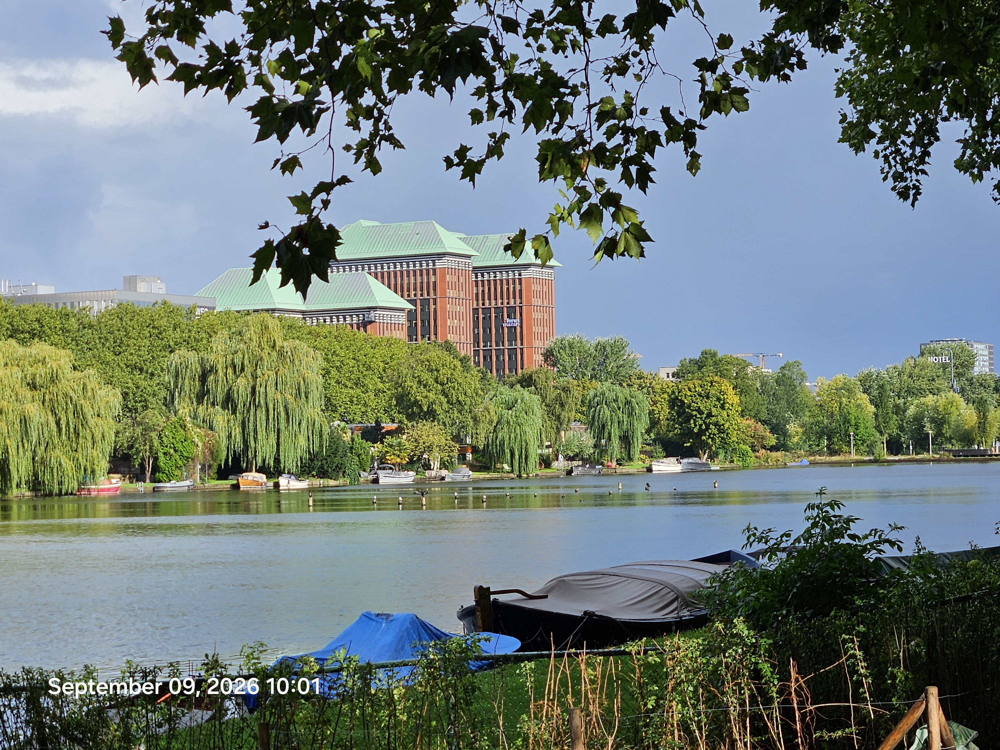
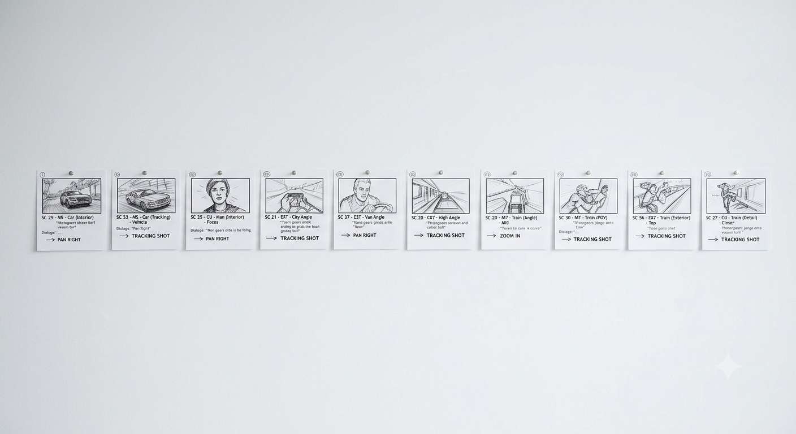
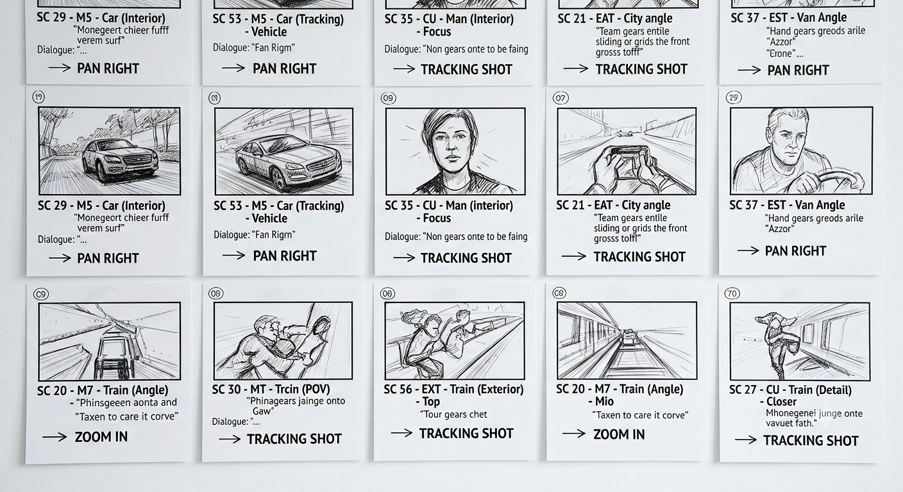

# Issue #35: Anchor the crow.  Fav: aggresssskuuuuuaaaw

- State: open
- Author: attogram
- Created: 2026-09-09T08:25:45Z
- URL: https://github.com/attogram/THE-ERROR-IS-THE-MESSAGE/issues/35

## Body

### Comment by attogram at 2026-09-09T08:26:50Z

### Comment by attogram at 2026-09-09T08:55:27Z

<message-content>
<strong>Video Generation Prompt</strong>

Animate an anthropomorphic black crow named Anchor with a distinct white &quot;V&quot; shape on its chest. The video starts in a dimly lit corporate office where Anchor wears a black business suit and red bow tie. Suddenly, Anchor rips off the suit to reveal a black leather jacket underneath, black corpse paint appearing around its eyes. The scene aggressively transitions to a night park illuminated by flashing neon stage lights. Anchor violently grips a metallic microphone, screaming hardcore metal vocals into it, with flames rising in the background and heavy camera movement.

<strong>4x4 Storyboard Matrix: &quot;Anchor&#39;s Corporate Catharsis&quot;</strong>

  | Column 1: Setting & Visuals | Column 2: Anchor's Appearance | Column 3: Key Action | Column 4: Audio & Energy
-- | -- | -- | -- | --
Row 1: 0–3s (Office) | Fluorescents buzzing, beige cubicles, stacked paperwork. | Black business suit, red bow tie, clean face, white "V" visible at collar. | Sitting stiffly, staring blankly at a computer screen as the clock strikes 5 PM. | Dull office hums, ticking clock; suppressed tension.
Row 2: 3–5s (Rupture) | Lights flicker and spark; desk shakes violently. | Suit fabric tearing; bow tie flying off; leather outfit underneath exposed. | Grasping collar with both wings and ripping the business suit entirely off in one pull. | Loud fabric rip, heavy bass drop, low guttural growl build-up.
Row 3: 5–8s (Transformation) | Rapid background transition from office walls to dark, neon-lit park. | Black corpse-paint instantly flashes around eyes; leather jacket fully zipped. | Spreading wings wide, leaping onto a park bench, grabbing a microphone from mid-air. | Explosive metal guitar riff, heavy double-bass drum beats.
Row 4: 8–10s (Catharsis) | Dark park background with roaring flames, neon lights, and smoke. | Full metal persona: leather jacket, white "V" visible, intense glowing red eyes. | Screaming violently into the mic, headbanging rapidly as flames swell behind. | Aggressive death metal roar / screaming bird caw; peak chaos.

</message-content>

### Comment by attogram at 2026-09-09T08:55:53Z

