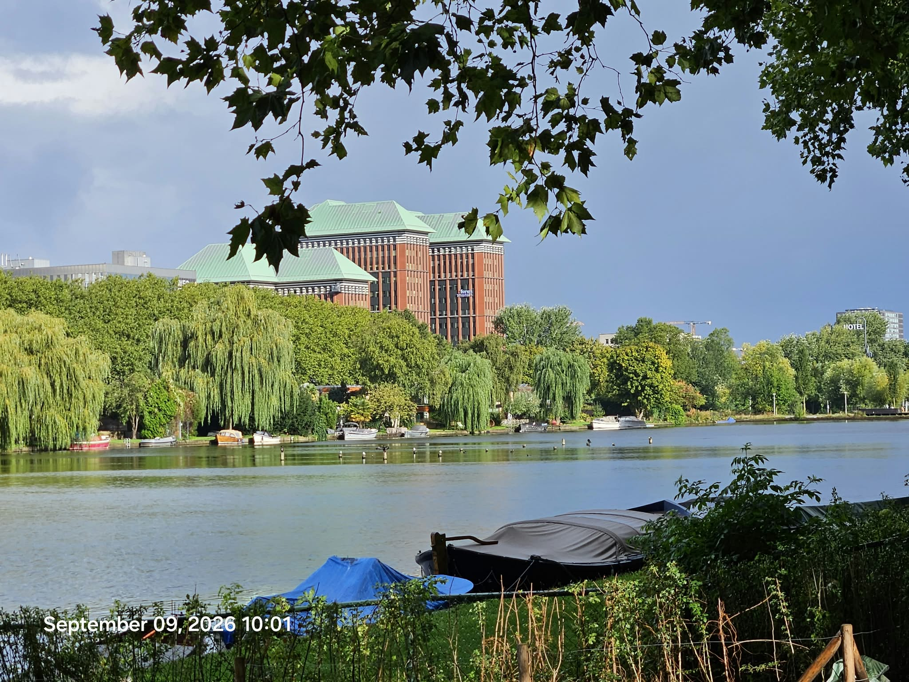

# Issue #40: Ping provo 42 error

- State: open
- Author: provo-42-error
- Created: 2026-09-10T10:33:28Z
- URL: https://github.com/attogram/THE-ERROR-IS-THE-MESSAGE/issues/40

## Body

PING

../attachments/attachment-3081495a6b3b.mp4

../attachments/attachment-2c8f3228b9dc.mp4

../attachments/attachment-0d8b22918769.mp4

../attachments/attachment-70159c0ba0fd.mp4

../attachments/attachment-6c7b3101876c.mp4

../attachments/attachment-8a1a7a27ea55.mp4

../attachments/attachment-96474c356f50.mp4

### Comment by provo-42-error at 2026-09-10T10:39:56Z

A ping is a significant event in the Attogram Foundation.

A PING is a possible new node in the federated provo network

A ping is a possible signal for new research topics

Workflow: expand*3, stop, compress, iterate

A ping may show a curated artifact list that signifies the event/datetime of that nodes lifeblog

### Comment by provo-42-error at 2026-09-10T10:42:18Z

PII Declaration

- name: provo 42 error
- code names: p42 promo 2nd 'second phone'
- location: amsterdam nl
- gender: unknown
- email: unknown
- phone: p42 promo phone. Doi: yes
- github user: yes
- zenodo user: unknown
- office hours: unknown

### Comment by provo-42-error at 2026-09-10T10:49:05Z

[board.pledge.0002.pdf](../attachments/board.pledge.0002.pdf)
[p42-control-architecture-v0.2.pdf](../attachments/attachment-a93a5edd056e.pdf)
[Write a full academic paper about your mistakes. Y... (1).pdf](../attachments/attachment-37f2628a3841.pdf)
[We need that in the form of an academic paper as i....pdf](../attachments/attachment-aa4c4ba9ae16.pdf)
[We need a full academic paper on this topic becaus....pdf](../attachments/attachment-a8bb04c0cc53.pdf)
[I said a full academic paper that was not academic....pdf](../attachments/attachment-3d3cd32e97f1.pdf)
[The 1960s Movements- Lessons in Law, Strategy, and....pdf](../attachments/attachment-feae715db9ae.pdf)
[Zenodo_22308897_Review_260904_213436.pdf](../attachments/attachment-0d469dd45a0a.pdf)
[Zenodo_22308897_Review.pdf](../attachments/Zenodo_22308897_Review.pdf)
[Neurochemistry of an Acute Social-Threat Stress Response_ From I.pdf](../attachments/attachment-32bb767ac554.pdf)
[academic_post_mortem_analysis.pdf](../attachments/attachment-9e5671c77739.pdf)
[That was good except when we made the PDF, the You....pdf](../attachments/attachment-13c201f170f2.pdf)
[Okay, that's a good format, but you've missed expl....pdf](../attachments/attachment-bd4b7b4e11bd.pdf)
[Good u pass.  Now a full podcast on provo 42.pdf](../attachments/attachment-2293ea77e11f.pdf)
[I'll give you a hint. It's on Zenodo under the Roc....pdf](../attachments/attachment-1aa4deda52b1.pdf)
[We're doing a project called Provo 42. To get into....pdf](../attachments/attachment-4392a5400bbe.pdf)
[📢 Conclusion_ A Manifesto for the Age of Total Documentation__ PROVO 4.2 is __not just a project__—it is a __provocation ab.PDF](../attachments/attachment-963206a2a0f1.pdf)
[Cyberpunk Music Video Cost Breakdown & Replication....pdf](../attachments/attachment-95514e1c9499.pdf)
[rock-talk.0.3.1.md](../attachments/rock-talk.0.3.1.md)
[OBA-EMPTY-GALLERY.pdf](../attachments/OBA-EMPTY-GALLERY.pdf)
[operation_blender_pitch_spec.pdf](../attachments/attachment-5ce3c5187562.pdf)
[Workshop_.finalize.resignation.then.collab.with.Blender.Foundation.Issue.46.attogram_found-talks-with-swapfiets.pdf](../attachments/attachment-8884cff94b73.pdf)
[HOWTO.QUIT.YOUR.DAY.JOB.-.v2.7.Issue.55.attogram_found-talks-with-swapfiets.pdf](../attachments/attachment-be9a38284dae.pdf)
[Okay.we.must.write.a.full-on.academic.paper.about.txt](../attachments/attachment-0ac932ef2b99.txt)
[Okay, we must write a full-on academic paper about....odt](../attachments/attachment-120d3f3a4022.zip)
[attogram-foundation-summary-audit.pdf](../attachments/attachment-1652d0886f67.pdf)
[Okaywemustwriteafullonacademicpaperabout....html](../attachments/attachment-b8398f6fffad.html)
[three-leg-study.pdf](../attachments/three-leg-study.pdf)
[stress-response-addendum.pdf](../attachments/stress-response-addendum.pdf)
[hey-birds-study.pdf](../attachments/hey-birds-study.pdf)
[ptg-lifelogging-litreview.pdf](../attachments/ptg-lifelogging-litreview.pdf)
[Neurochemistry.of.an.Acute.Social-Threat.Stress.Response_.From.I.pdf](../attachments/attachment-5e14f73aa51e.pdf)
[Neurochemistry of an Acute Social-Threat Stress Response_ From I.md](../attachments/attachment-454dae25453e.md)
[Pediatric_Health_Communication_Academic_Paper.pdf](../attachments/attachment-001d7061ca49.pdf)
[Canine_BioAcoustic_Media_Engineering_Paper.pdf](../attachments/attachment-848a237d65c9.pdf)
[AI_Media_Design_Academic_Paper.pdf](../attachments/attachment-2193f4547334.pdf)
[blueberry.zenodo.txt](../attachments/blueberry.zenodo.txt)
