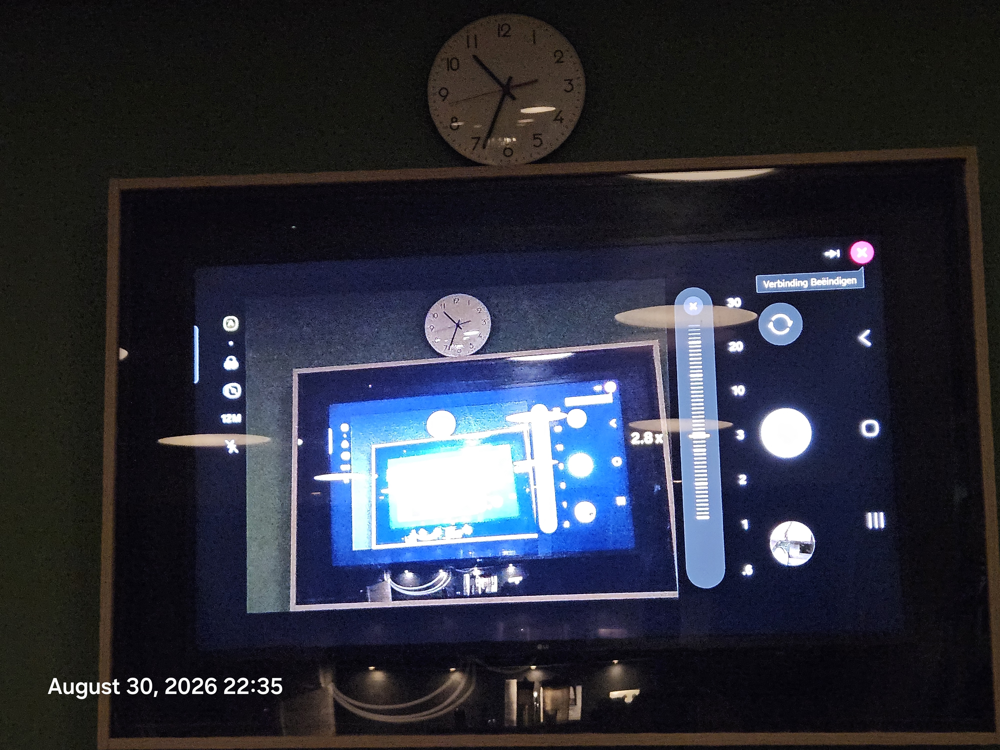
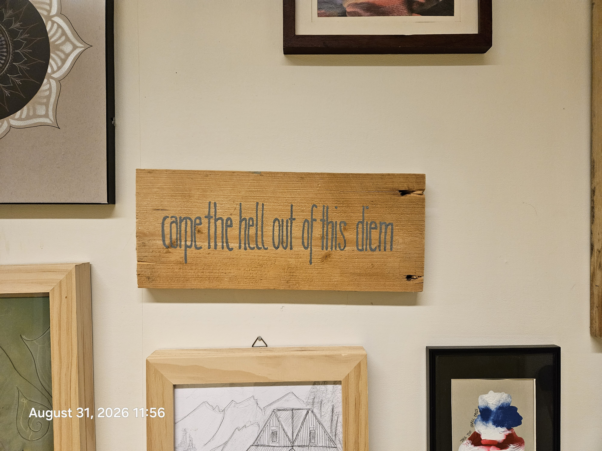

# Release 0001

- Name: 0001
- Tag: 0001
- Author: attogram
- Published: 2026-08-31T16:29:50Z
- URL: https://github.com/attogram/THE-ERROR-IS-THE-MESSAGE/releases/tag/0001

## Notes

**Full Changelog**: https://github.com/attogram/THE-ERROR-IS-THE-MESSAGE/compare/0000...0001

../attachments/attachment-9af393d5e049.mp4

../attachments/attachment-9bbb6efaab83.mp4

../attachments/attachment-cf1568f81f76.mp4

../attachments/attachment-4f829ace6990.mp4

../attachments/attachment-d9a9dc9d1124.mp4

../attachments/attachment-3743da47317e.mp4

../attachments/attachment-05a5e2c35362.mp4

[Provo 42 Field Operations Manual & Archival Ledger.pdf](../attachments/attachment-b7c49c9816d3.pdf)

../attachments/attachment-e55232ad180d.mp4

../attachments/attachment-c9f90d991978.mp4

../attachments/attachment-53371ebdf50a.mp4

../attachments/attachment-0a99c961be66.mp4

../attachments/attachment-1520151dab6f.mp4

../attachments/attachment-bb814a550341.mp4

../attachments/attachment-0e1f33c77092.mp4

../attachments/attachment-92a944ca7554.mp4

../attachments/attachment-059251f2e017.mp4

../attachments/attachment-e65e67ea597c.mp4

../attachments/attachment-e5ea0055e0f1.mp4

../attachments/attachment-a08ab9310261.mp4

../attachments/attachment-c75c5f8f667c.mp4

../attachments/attachment-18b85cae9605.mp4

../attachments/attachment-5d439dcc5fb4.mp4

../attachments/attachment-3ecf13f52874.mp4

../attachments/attachment-b4dd744b5570.mp4

../attachments/attachment-9ae82319fce0.mp4

../attachments/attachment-e081d9c672cf.mp4

../attachments/attachment-6e6e111c77ea.mp4

../attachments/attachment-c8cd9a1a458e.mp4

../attachments/attachment-5f7e2e388366.mp4

../attachments/attachment-c99599aa5a49.mp4

../attachments/attachment-b13eecdcfb3d.mp4

../attachments/attachment-de64f6be3857.mp4

Skip to content
THE-ERROR-IS-THE-MESSAGE
Repository navigation
Code
Issues
10
 (10)
All issues
Issues
Search Issues
is:issue state:open 
Search results

Select all issues: Search results
0 of 10 selected0 issues of 10 selected
Open
10
 (10)
Closed
0
 (0)
[DOI PENDING] Calculated Motion

Status: Open.
#10 In attogram/THE-ERROR-IS-THE-MESSAGE;· attogram opened 15m ago
Football....

Status: Open.
#9 In attogram/THE-ERROR-IS-THE-MESSAGE;· attogram opened 1h ago
6
comments
https://zenodo.org/records/22179960 - DIGITAL HISTORICAL ARCHAEOLOGY [DHA] Soundtrack batch 0003

Status: Open.
#8 In attogram/THE-ERROR-IS-THE-MESSAGE;· attogram opened 1d ago
https://zenodo.org/records/22171246 - DIGitaL HISTORICAL ARCHAEOLOGY [DHA] Videos batch 0002

Status: Open.
#7 In attogram/THE-ERROR-IS-THE-MESSAGE;· attogram opened 1d ago
attogram
Rain rain rain 2026 08 30

Status: Open.
#6 In attogram/THE-ERROR-IS-THE-MESSAGE;· attogram opened 1d ago
2
comments
# AI-Induced Psychosis: A Ward Observation *An essay on a phenomenon observed firsthand in a clinical psychiatric ward, August 2026.*

Status: Open.
#5 In attogram/THE-ERROR-IS-THE-MESSAGE;· attogram opened 1d ago
2
comments
Eat like a king

Status: Open.
#4 In attogram/THE-ERROR-IS-THE-MESSAGE;· attogram opened 1d ago
2
comments
Summary 2026.08.30 09:15

Status: Open.
#3 In attogram/THE-ERROR-IS-THE-MESSAGE;· attogram opened 1d ago
Mistral attempts DHA

Status: Open.
#2 In attogram/THE-ERROR-IS-THE-MESSAGE;· attogram opened 1d ago
5
comments
https://doi.org/10.5281/zenodo.22169941 - DIGITAL HISTORICAL ARCHAEOLOGY [DHA] Documents batch 0001

Status: Open.
#1 In attogram/THE-ERROR-IS-THE-MESSAGE;· attogram opened 1d ago
4
comments
attogram
Footer
© 2026 GitHub, Inc.
Footer navigation
Terms
Privacy
Security
Status
Community
Docs
Contact
Manage cookies
Do not share my personal information

## Artifacts

- (none)
